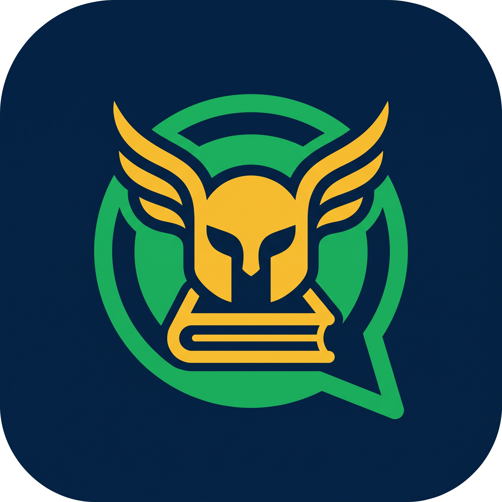

# Hermes Bot

<div align="center">
  
</div>

Hermes Bot es un proyecto de bot para WhatsApp pensado para responder consultas, manejar acceso por invitación y estructurar un flujo de mensajes claro y útil.

Esta es una versión pública y segura. Está hecha para que cualquiera pueda verla, bajarla, entenderla y probarla sin acceder a secretos, credenciales ni datos reales de producción.

## Qué es esta versión

La versión pública no incluye nada privado:

- tokens reales
- secretos de Meta
- claves de Google
- base de datos de producción
- listas sensibles
- información interna

Si faltan variables de entorno, la app queda en modo seguro y no intenta conectarse a servicios reales.

## Demo rápida

La idea general del bot es esta:

1. llega un mensaje por WhatsApp
2. el sistema revisa si el usuario está autorizado
3. si no está autorizado, pide código o lo ignora
4. si está validado, procesa la consulta
5. responde con la lógica del motor del bot

Ejemplo simple:

```text
Usuario: ayuda
Bot: Te muestro las opciones disponibles.

Usuario: generar codigo
Bot: Aquí tenés tu código de invitación.
```
## Cómo correrlo

### 1) Cloná el repositorio

```bash
git clone https://github.com/argentumguy/hermesbot.git
cd hermesbot
```

### 2) Instalá dependencias

```bash
pip install -r requirements.txt
```

### 3) Crear tu archivo de entorno

```bash
copy .env.example .env
```

En Linux/macOS:

```bash
cp .env.example .env
```

### 4) Si querés correr la versión real

Completá el `.env` con tus valores privados. Eso es solo para la versión privada del proyecto. Nunca lo subas a GitHub.

### 5) Ejecutá la app

```bash
python app.py
```

### 6) Si no pusiste configuración privada

La app queda en modo seguro y no intenta abrir conexiones reales. Eso evita errores por falta de secretos, base de datos o servicios externos.

## Estructura principal

- app.py: punto principal de la app
- conexion.py: conexión con datos y recursos
- control_acceso.py: validación y códigos de acceso
- motor.py: lógica del bot
- utils.py: funciones auxiliares
- requirements.txt: dependencias
- .env.example: ejemplo de configuración

## Para colaborar

Si querés aportar, podés hacer fork, abrir PR y mejorar la lógica, la documentación o la experiencia del proyecto. Solo hay que evitar secretos, datos reales y información sensible.

## Importante

Este repositorio es una versión pública segura. Está pensado para mostrar la idea del proyecto y permitir que alguien lo vea, estudie y contribuya sin romper por falta de acceso a producción.

La versión completa y real se mantiene en un entorno privado.

## Licencia

Proyecto compartido para estudio, prueba y colaboración pública.
